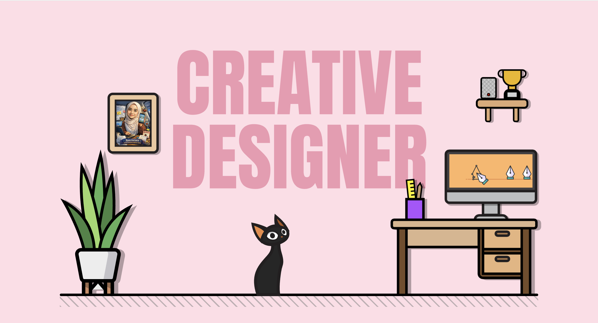

<div align="center" style="background-color:#ffdde6; padding: 20px;">
    
</div>


<h1 align="center">Wifey's Portfolio</h1>
<h3 align="center">It was an opportunity to translate my wife's work, creativity, and personality into a clean and engaging digital space. I focused on crafting a smooth and intuitive interface while letting her achievements and story take center stage. The result is a portfolio that blends thoughtful design, modern technology, and a touch of personal care behind the scenes.</h3>

<h2 align="center">Project Link  🖥️</h2>
<p align="center">https://syazareen-nafisah.web.app/home</p><br><br>

```bash
# The Author
@thecodemeor
```